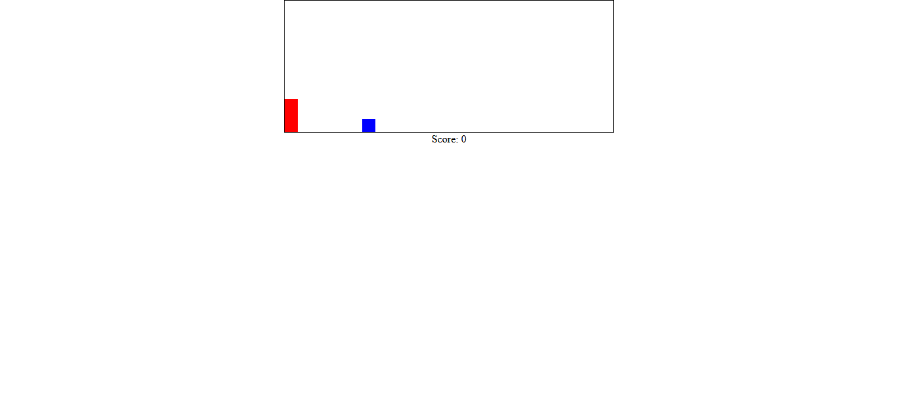

# Time Js  

## trabajo realizado individualmente en el bootcamp 

### Contexto del proyecto:

En una entrevista técnica se nos pide que desarrollemos un pequeño ejercicio que demuestre nuestras capacidades para manejar el tiempo en Javascript.
En el enunciado se puede entrever que se van a valorar, también, nuestros skills de HTML, y Css así como la creatividad y diseño.

Así que:

Debemos desarrollar una mini aplicación parecida a un cronómetro, cuenta atrás, juego, etc.. que permita a la empresa ver nuestras habilidades, entregar el código en un repositorio con un ReadMe atractivo y una url en que se muestre la aplicación.

### Core Skills:

    Manejar el tiempo en Javascript
    Crear una interface en HTML y CSS
    
#### Link git pages.
https://sergiopons.github.io/Contadores/

 
